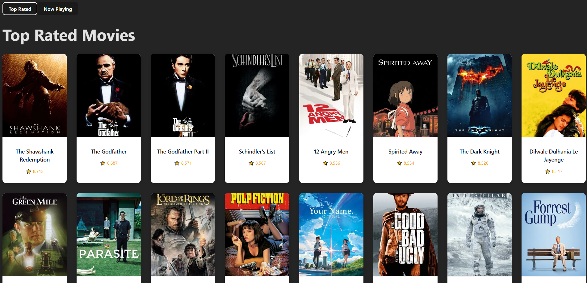
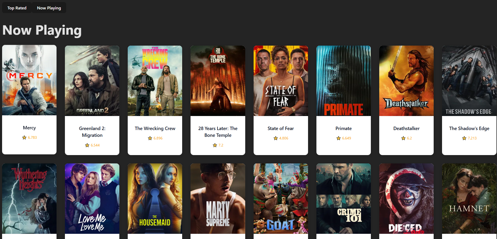

🎬 Proyecto The Movie Data Base

Fullstack movie explorer application built with Spring Boot and React.
The application consumes an external movie API and provides a modern UI to explore top-rated films.

🚀 Tech Stack
Backend

Java 17+

Spring Boot

Maven

REST API architecture

DTO pattern

External API consumption

Frontend

React (Vite)

JavaScript (ES6+)

CSS (custom styling)

Fetch API

🏗 Project Structure
cinematica/
│
├── backend/      # Spring Boot application
│
├── frontend/     # React application
│
└── README.md

This project follows a monorepo structure, where frontend and backend live in the same repository but remain independent applications.

⚙️ Backend Setup

1️⃣ Navigate to backend
cd backend

2️⃣ Configure environment variables

Create an environment variable for your movie API key:

Mac / Linux

export TMDB_API_KEY=your_api_key

Windows (PowerShell)

setx TMDB_API_KEY "your_api_key"

3️⃣ Run the application
./mvnw spring-boot:run

Backend runs on:

http://localhost:8080

Example endpoint:

GET /films/top-rated

💻 Frontend Setup

1️⃣ Navigate to frontend
cd frontend

2️⃣ Install dependencies
npm install

3️⃣ Run development server
npm run dev

Frontend runs on:

http://localhost:5173

🔌 How It Works

React frontend makes HTTP requests to the backend.

Spring Boot backend consumes an external movie API.

Backend maps responses using DTOs.

Clean JSON is returned to the frontend.

React renders a modern movie catalog UI.

✨ Features

Fetch and display top-rated movies

Responsive movie grid layout

Modern movie cards with posters

Clean layered backend architecture (Controller → Service → Client → DTO)

🧠 Architecture Principles

Separation of concerns

DTO pattern for external API mapping

Clean REST design

Environment-based API key configuration

Reusable React components

📌 Future Improvements

Search functionality

Filtering & pagination

Database integration (favorites)

User authentication (JWT)

Dockerization

Deployment

📷 Preview

👨‍💻 Author

Built as a fullstack learning project to practice:

Spring Boot

REST APIs

React architecture

Fullstack integration
